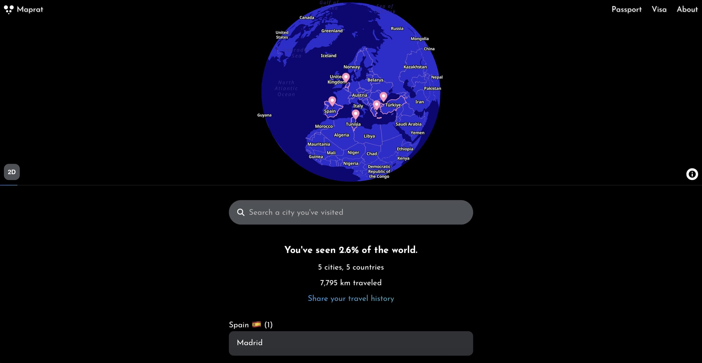
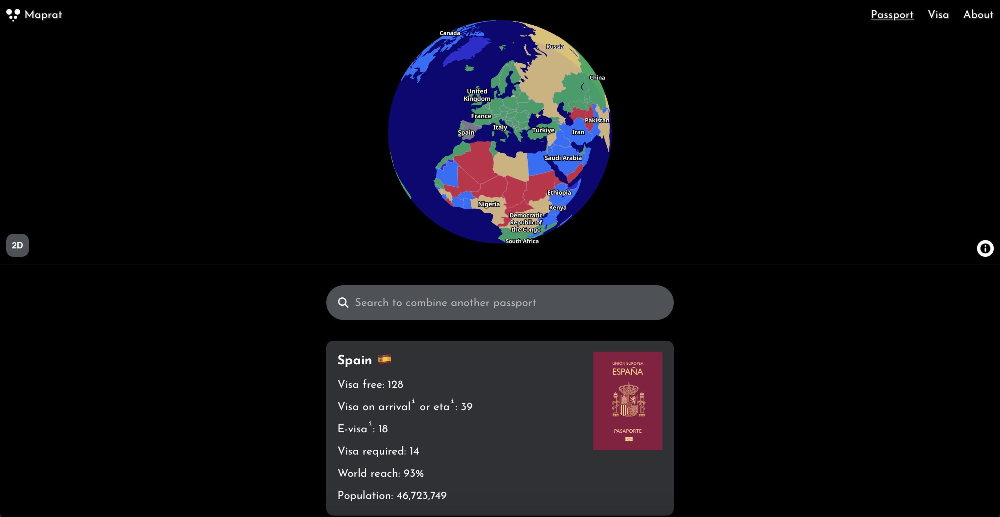

# Maprat.com - Geospatial Data Visualization Project

**Maprat.com** is an interactive web app for visualizing global travel history and passport visa requirements using both 2D and 3D globe views.

🌍 [Visit Maprat.com](https://maprat.com)

### Travel History

### Visa Requirements View  
  

## Features

- 🌐 **Travel History**  
  Add cities by typing their names or clicking the map to track your travels.

- 🛂 **Passport Requirements**  
  - Enter a country to see its visa requirements, both on the map and in a filterable list.  
  - Combine up to 5 passports to visualize visa-free access across countries.

- 🧭 **Interactive Globes**  
  Toggle between 2D and 3D globe visualizations.

## Built With

- [Svelte](https://svelte.dev)  
- [MapLibre](https://maplibre.org)  
- [GeoNames](https://www.geonames.org)  
- [Natural Earth](https://www.naturalearthdata.com)  
- [2025 Passport Index Dataset](https://github.com/ilyankou/passport-index-dataset)

## Disclaimer

Visa requirement data may not be up to date and is for demonstration purposes only.

## License

All rights reserved. This project is not open source.